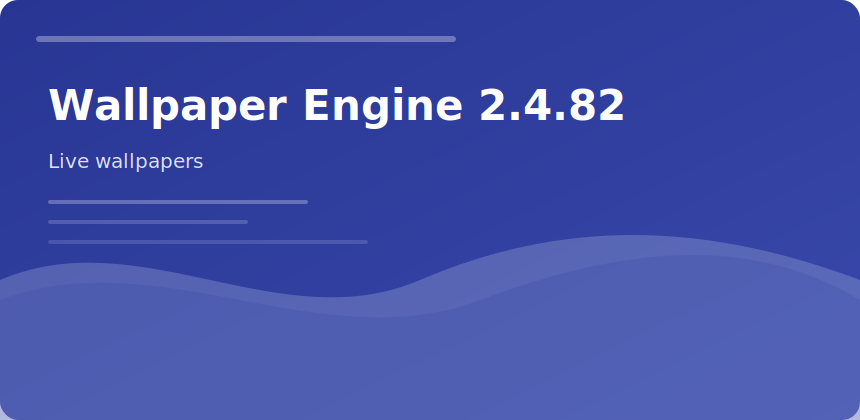

  

  

## Wallpaper Engine 2.4.82

Animated desktop backgrounds from **Workshop** or **custom HTML/WebGL** scenes.

### Scene types

- Video loops
- 2D/WebGL shaders
- Interactive click effects
- Audio spectrum layers

### Settings cheat sheet

| Goal | Toggle |
|------|--------|
| Gaming FPS | Pause on fullscreen |
| Battery | Lower quality + stop on battery |
| Ultrawide | Per-display profiles |

v2.4.82 fixes multi-GPU laptop sleep/wake black screen on hybrid graphics.

wallpaper engine live wallpaper steam desktop customization
